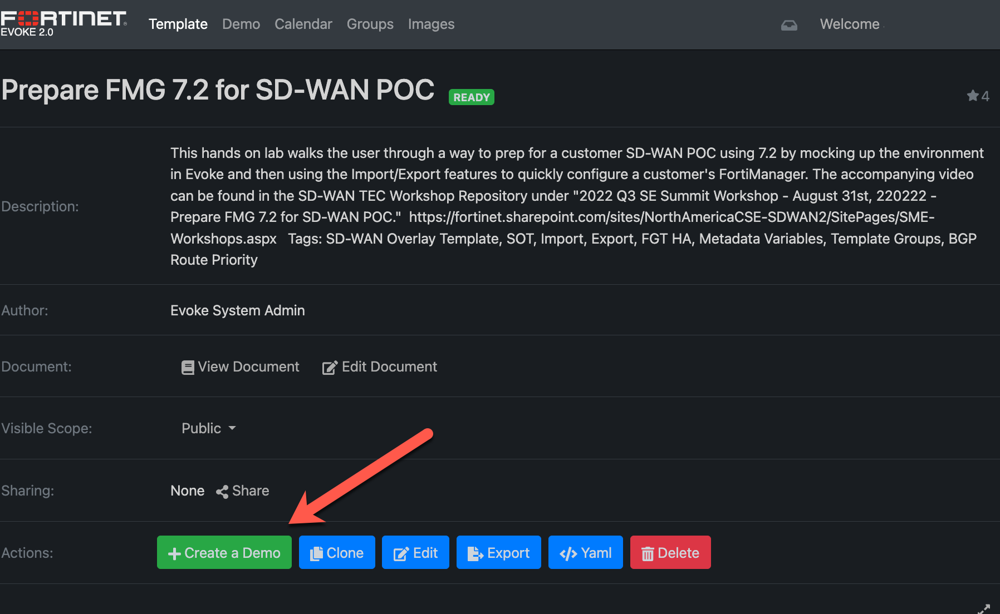
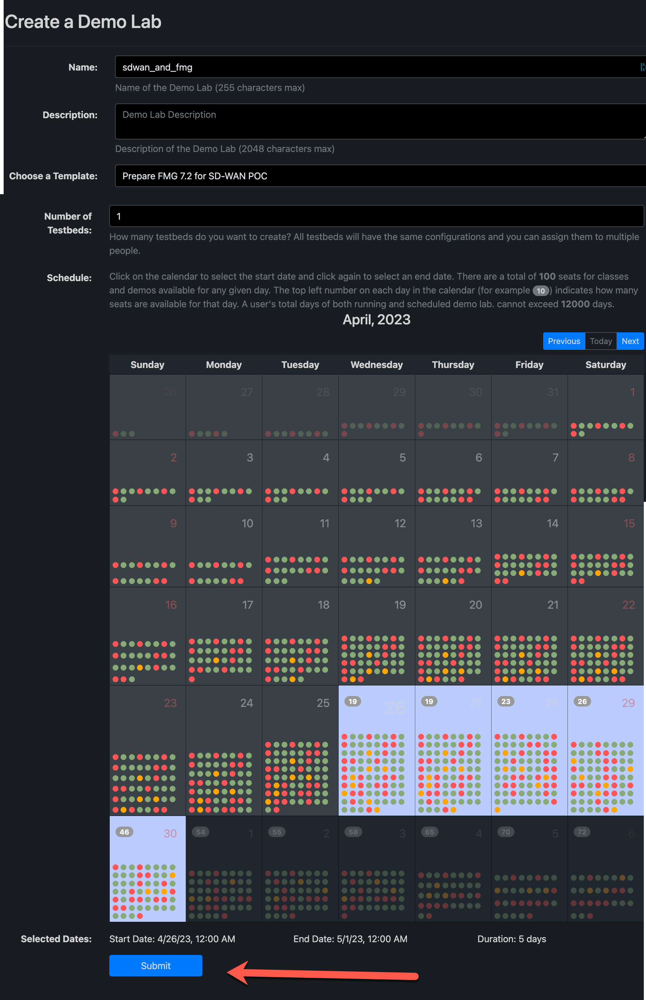

### Lab Preparation - Location

__** Prerequisite **__ The virtual environment used in this lab is presented through EVOKE. You must be either on the corporate network directly or connected via VPN.

The template used for this environment can be found [here](https://evoke.fortinet.com/template-details/630a4628b5405004af171d51)

Using that template, simply click the ```+ Create a Demo``` button as shown



At the ```Create a Demo Lab``` window, fill in the required information, then schedule your demo on the calendar and click ```Submit``` as demonstated below


