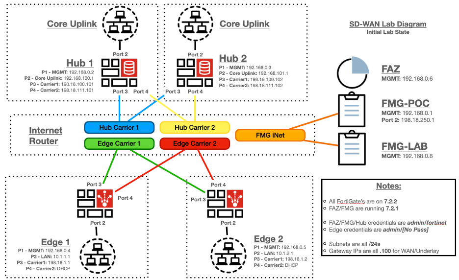

### Lab Preparation - Diagram

The lab topology diagram is found below. 

Much of this lab’s configuration will be similar to the existing SD-WAN Evoke 7.0 training lab and can be used as a starting place for most POCs.

