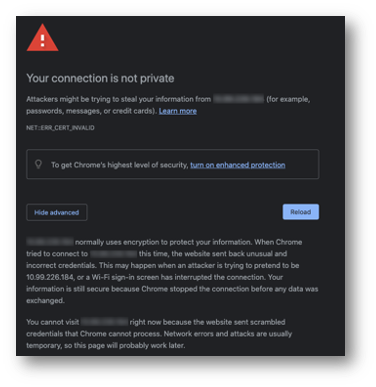

### Lab Preparation - What to Know

---

 When browsing to devices in this lab using the Chrome browser, you may be presented with the below warning and no option to click “Proceed to …..”.  If you encounter this, type “thisisunsafe” into the browser window and press enter/return to proceed to the login **(this is not recommended outside of this lab!)**.

---

1.	In the real world, you would export the necessary templates and scripts needed for this specific customer environment after your lab has been proven out.  We have attached those files to the Evoke demo in same place as this doc.
2.	FortiManager and FortiAnalyzer have been deployed as VMs on the lab MGMT network and licensed.  The default password has been set on these VMs to **“fortinet”**.
3.	On FortiManager there is an “external facing” interface (port2) to simulate a publicly accessible FMG.  This would normally be done with a VIP or similar on existing customer firewall.
