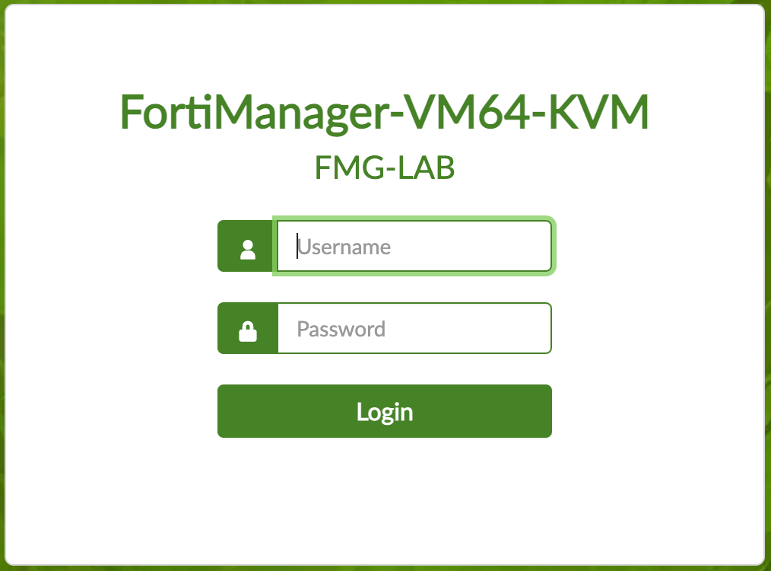

### Task 1 - Login to FMG

1.	Login to your “FMG-LAB” using admin/fortinet credentials.

---

 The initial FMG-LAB Setup has been completed for you.   Hostname, Time Zone, and various Admin Settings have been set.  Later in another lab you will configure all these settings on your FMG-POC.

---