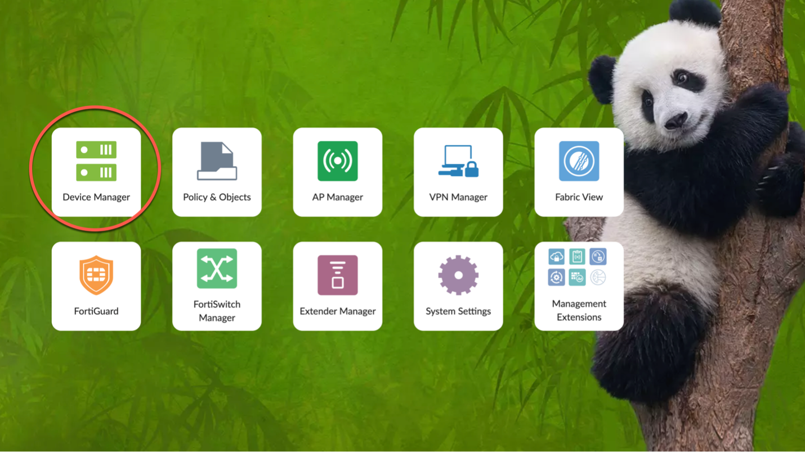
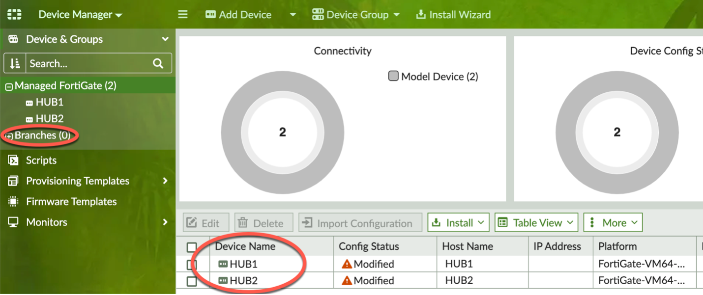
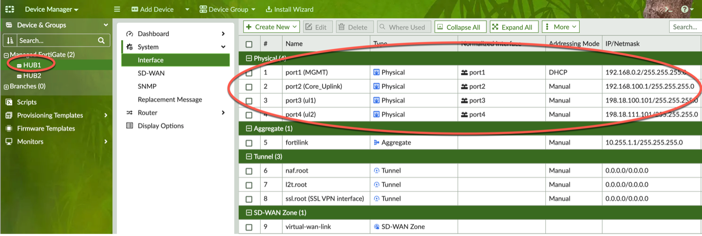
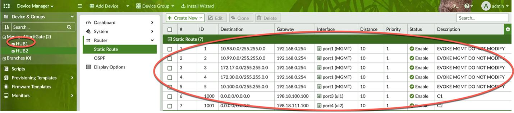
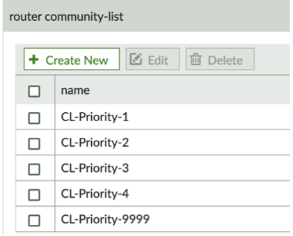
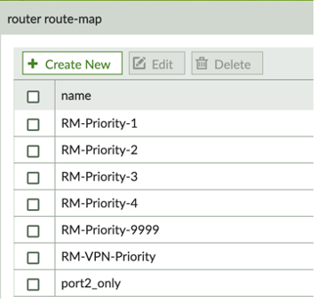

### Navigate to Device Manager
#### Review those things that have been accomplished for you to save time

Click on Device Manager.

‘HUB1’ and ‘HUB2’ model devices have already been created.  Also, a ‘Branches’ Device Group has been created which will be used later in this lab.

HUB1 and HUB2 are Fortigate-VM64-KVM model devices.  Both have had multiple interfaces added and configured along with multiple static routes needed for our Evoke Environment.

:pushpin: HUB1 Interfaces:

:pushpin: HUB1 Static Routes:

 To create an SD-WAN Overlay Template you must have a Hub model device(s) or “real” Hub FGT(s) joined to FMG with configured underlay interface(s) for VPN termination.  The IP address of these interfaces are needed to create the Branch IPSec Template.  For the Branch settings of the SOT, a device group is all that is needed.  As mentioned prior, the ‘Branches’ device group has been created. 

Route-Maps and Community Lists used in the SOT are also already configured in your FMG-LAB.

|  |  |
| --- | --- |
|  |  |
