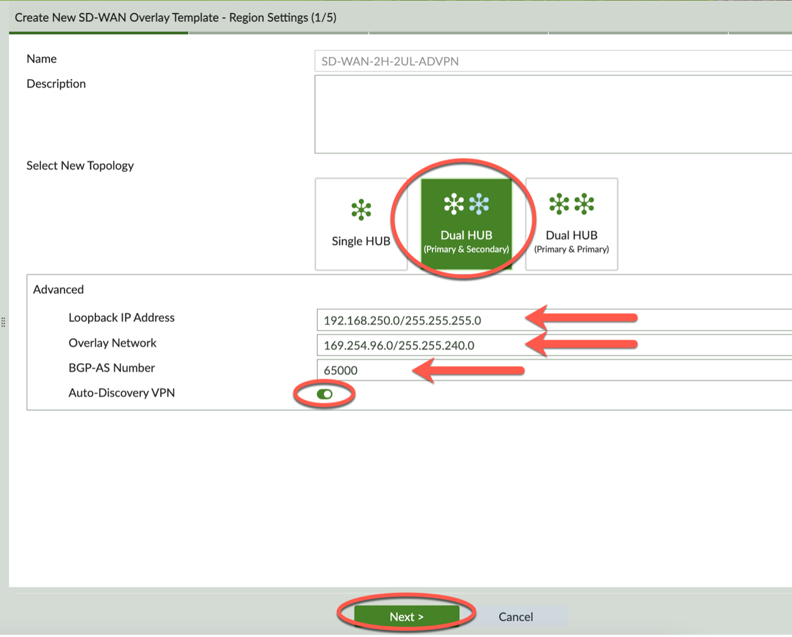

### Create SOT - Step 1

Complete Step 1 of 5 – Region Settings:

- Select New Topology – Dual Hub (Primary & Secondary)

- Expand Advanced
	- Loopback IP Address – 192.168.250.0/255.255.255.0
	- Overlay Network – 169.254.96.0/255.255.240.0
	- BGP-AS Number – 65000
	- Auto-Discovery VPN – Toggle On

- Click Next to complete Step 1

