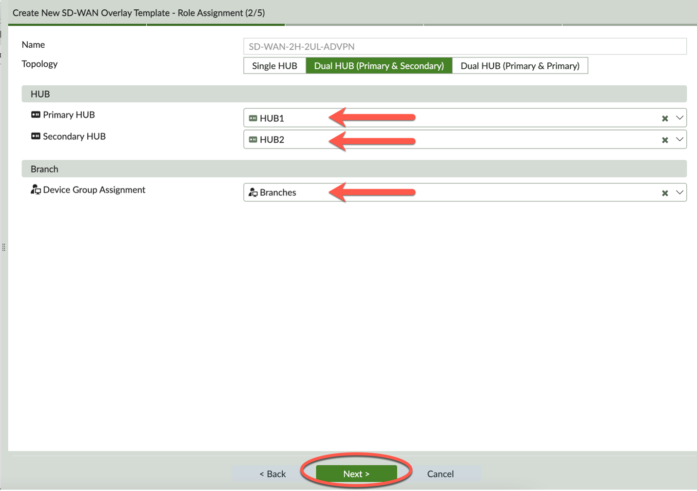

### Create SOT - Step 2

Complete Step 2 of 5 – Role Assignment:

- In the HUB section, 
	- Primary HUB - click to select ‘HUB1’ from the drop-down list
	- Secondary HUB - click to select ‘HUB2’ from the drop-down list

- In the Branch section,
	- Device Group Assignment – click to select ‘Branches’ from the drop-down list

- Click Next to complete Step 2

