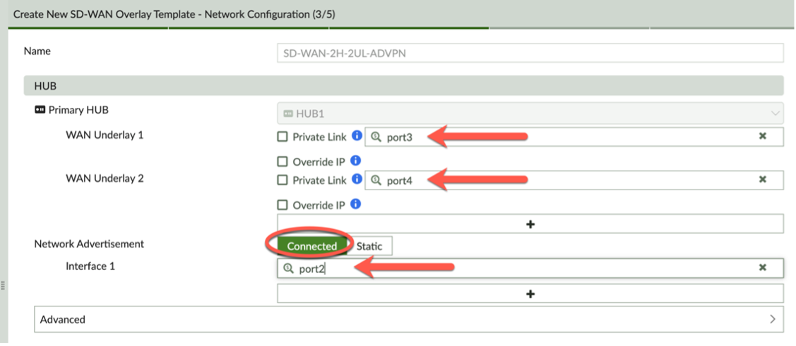
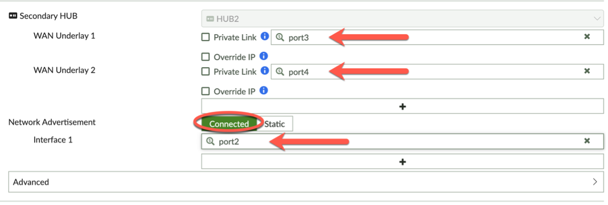
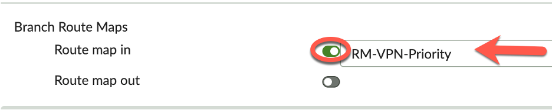
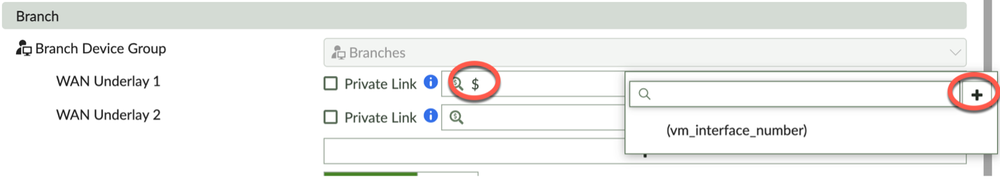
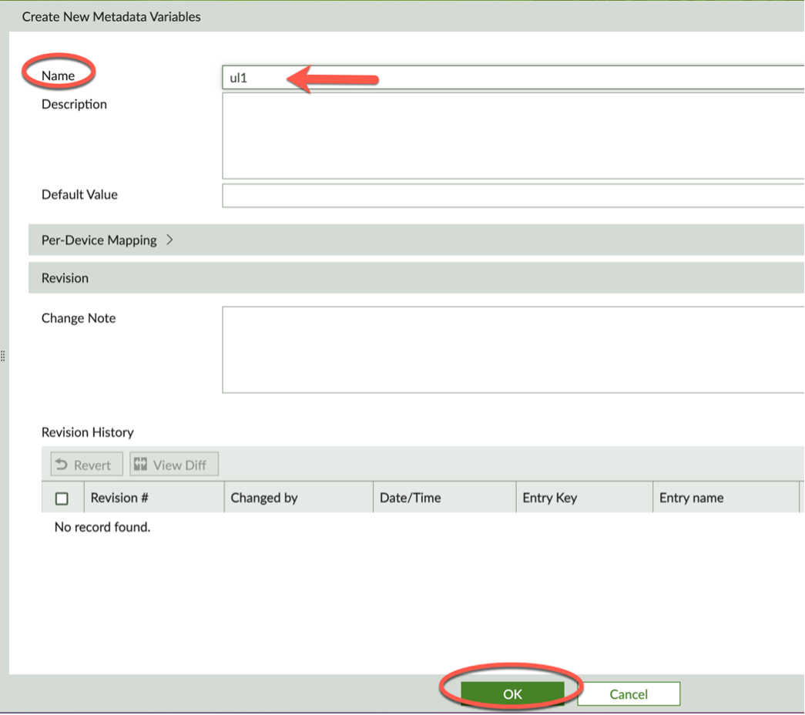
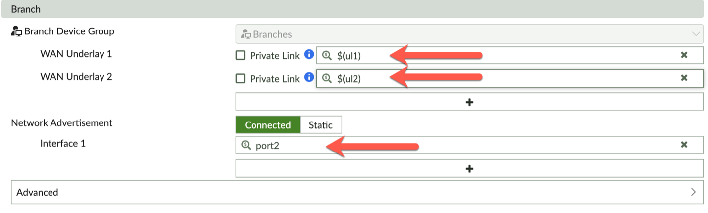
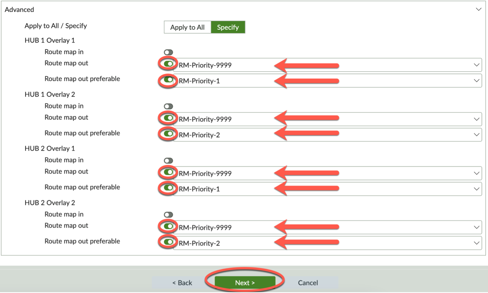

### Create SOT - Step 3

Complete Step 3 of 5 – Network Configuration:

- In the HUB section, 
- **Primary HUB**
	- WAN Underlay 1
		- Enter ```port3```
	- WAN Underlay 2
		- Enter ```port4```
	- Network Advertisement – Leave Connected selected
		- Interface
			- Click ```+```
			- Interface 1 – Enter ```port2```



- **Secondary HUB**
	- WAN Underlay 1
		- Enter ```port3```
	- WAN Underlay 2
		- Enter ```port4```
	- Network Advertisement – Leave Connected selected
		- Interface
			- Click ```+```
			- Interface 1 – Enter ```port2```



Branch Route Maps (Hub Route Maps applied on Branch neighbor-group(s))
- Route map in – Toggle on and select ‘RM-VPN-Priority’ from drop-down list
This is what applies the priority value to the routes learned from the branch based on in/out of SLA.



In the Branch section, 
	
**WAN Underlay 1**
- Type ```$``` 
- Then click the ```+```




- Create a New Metadata Variable ```ul1```
- Click 'OK'

- Select your newly created ul1 metadata variable from the drop-down list for your WAN Underlay 1.

**WAN Underlay 2**
- Follow the above steps and create a new Metadata Variable ```ul2``` and then select it for your WAN Underlay 2.
- Network Advertisement – Leave Connected selected
	- Interface
		- Click ```+```
		- Interface 1 – Enter ```port2``` (this could be a variable if needed)



- Click to expand the Advanced section:
		
This is where you will apply your Route map out and Route map out preferable routes maps that were provided for you in your FMG-LAB:

-	Toggle to on, then choose the route map from the drop-down list



- Click Next to complete Step 3.