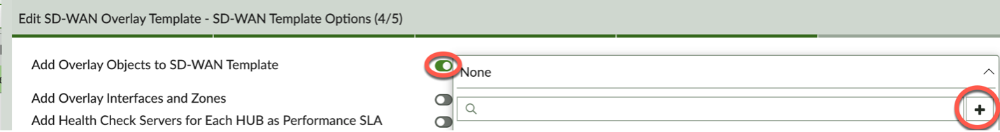
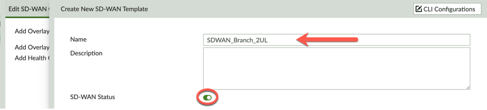
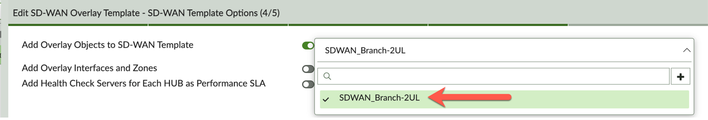

### Create SOT - Step 4

Complete Step 4 of 5 – SD-WAN Template Options:

Add Overlay Objects to SD-WAN Template:
- Toggle to on 
- Click on ```+``` to create an SD-WAN Template



- Name your SD-WAN Template - 'SDWAN_Branch_2UL'
- Toggle SD-WAN Status ‘on’



- Select your newly created SD-WAN Template from the drop-down list



- Add Overlay Interfaces and Zones – Toggle on
- Add Health Check Servers for Each HUB as Performance SLA – Toggle on


- Click 'Next' to complete Step 4.
