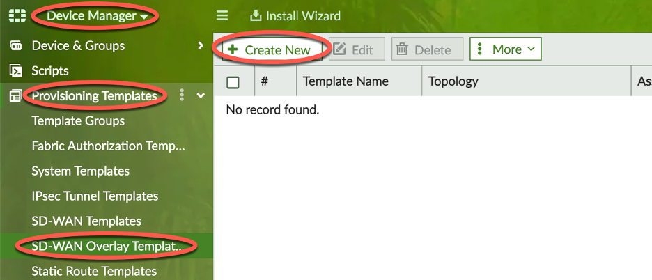
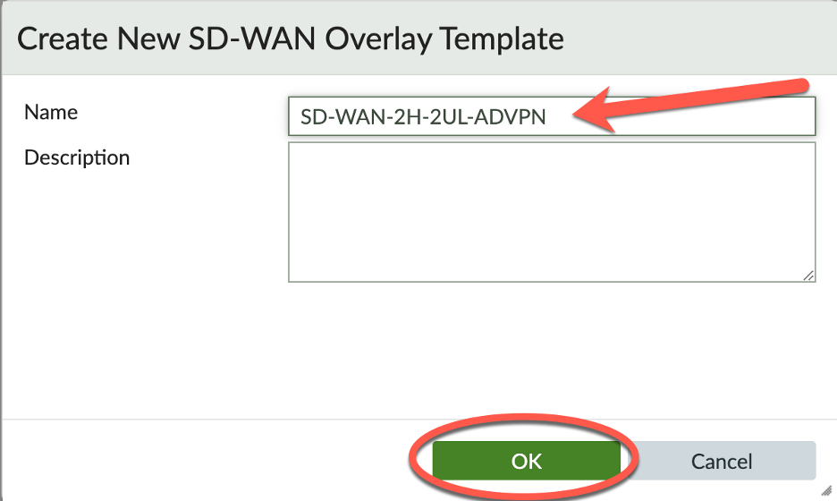

### Create SD-WAN Overlay Template (SOT)


1. Navigate to Device Manager -> Provisioning Templates -> SD-WAN Overlay Template
Click ```+ Create New``` button



2. Provide a SDWAN Overlay Template Name

  - ‘SD-WAN-2H-2UL-ADVPN’ name is used in this lab.  This name was chosen because there will be 2 Hubs, the Branches will have 2 underlays, and ADVPN will be enabled.

